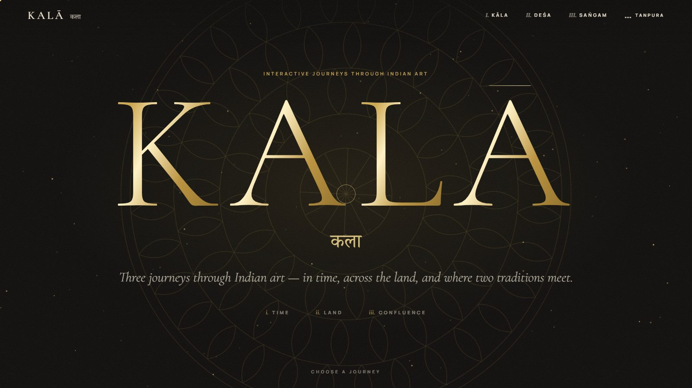
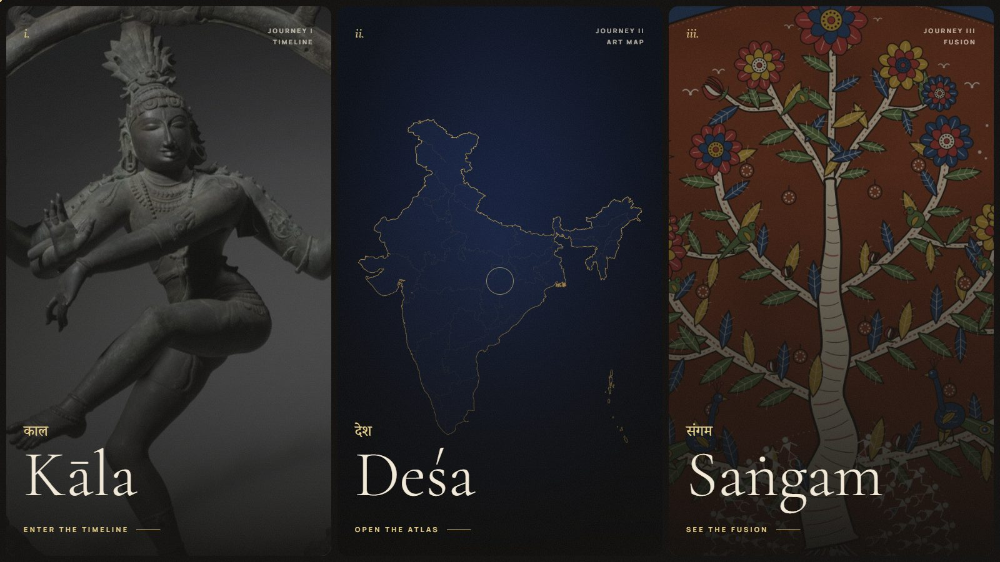
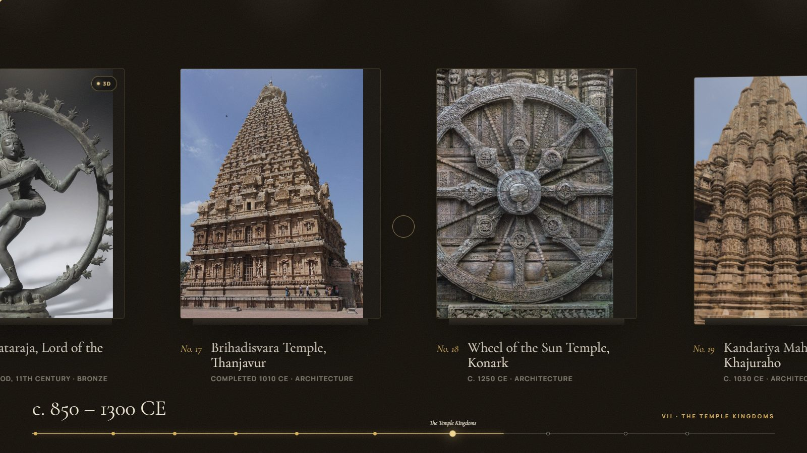
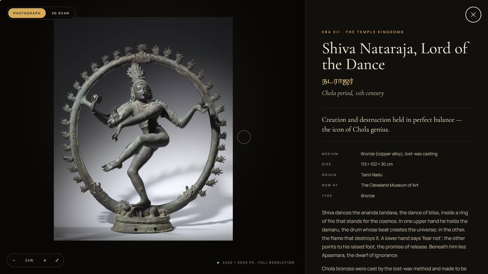
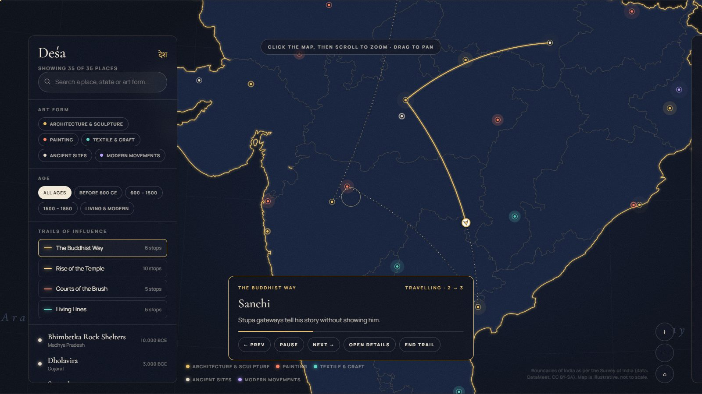
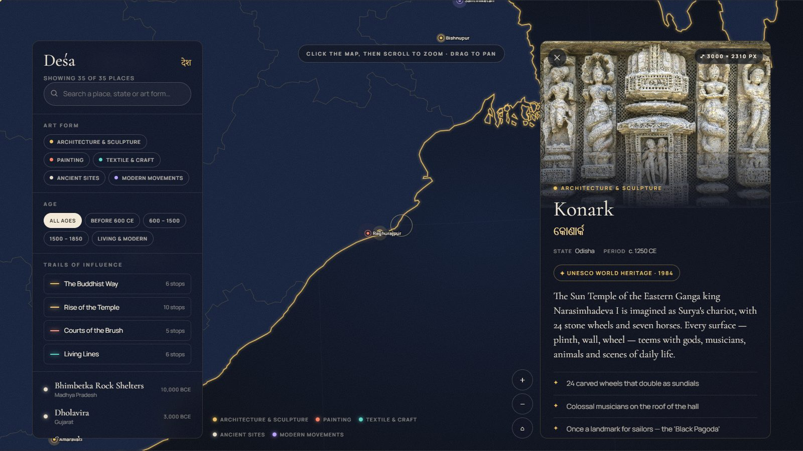
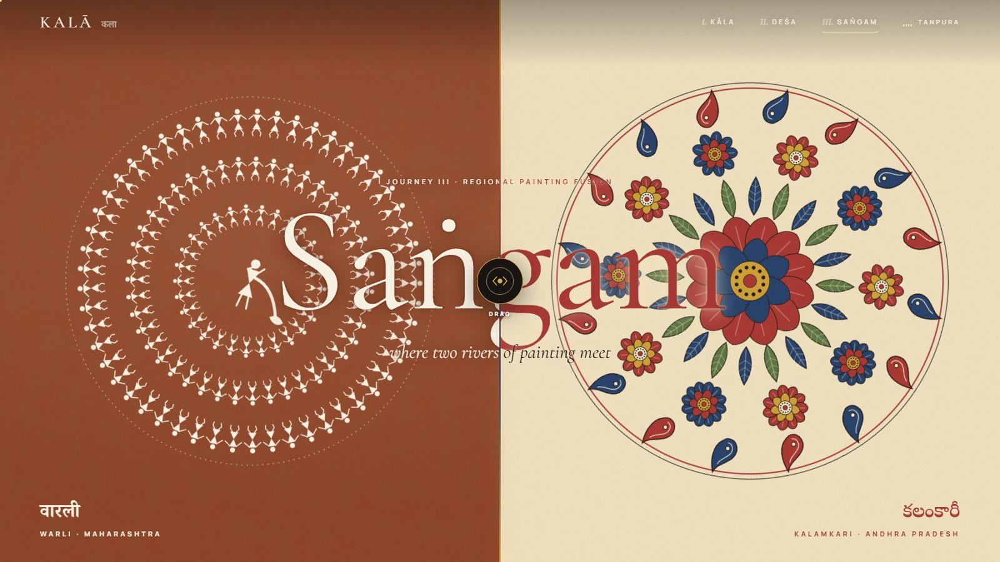
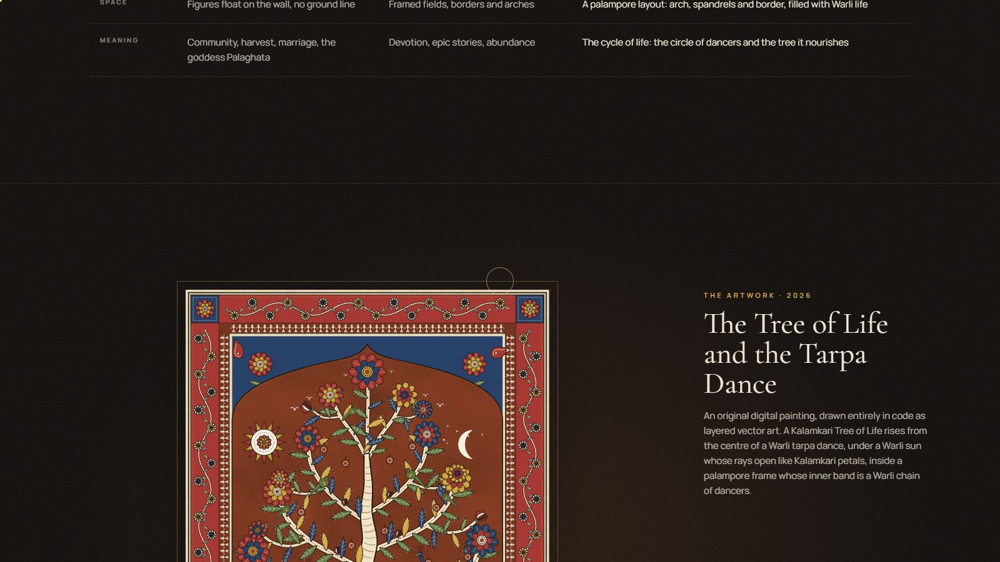
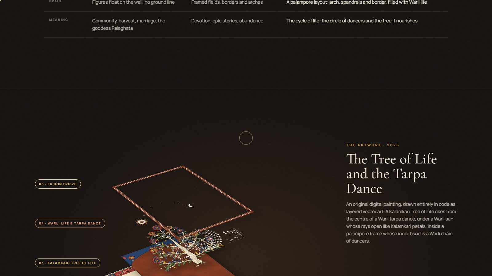
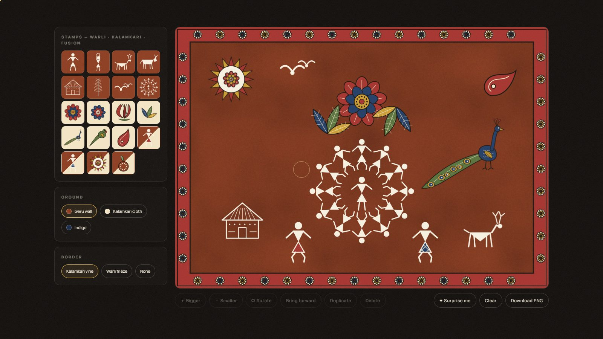

# KALĀ — Three Journeys Through Indian Art

**कला · Kalā** means *art*. **काल · Kāla** means *time*. This project brings the two together: three interactive websites that explore Indian art **in time**, **across the land**, and **where two painting traditions meet**.

**Live site → [kala-indianart.vercel.app](https://kala-indianart.vercel.app)**



Everything is hand-built in plain HTML, CSS and JavaScript (no framework, no templates) and shares one design language: a dark museum lit in gold. Pick a journey from the home page, or jump straight in:

| | Journey | What it is |
|---|---|---|
| i. | **[Kāla](https://kala-indianart.vercel.app/timeline/index.html)** | A sideways "museum walk" through 5,000 years of Indian art: 10 eras, 28 artifacts |
| ii. | **[Deśa](https://kala-indianart.vercel.app/map/index.html)** | An interactive atlas of 35 places where Indian art traditions were born, and the routes they travelled |
| iii. | **[Saṅgam](https://kala-indianart.vercel.app/fusion/index.html)** | An original artwork fusing Warli and Kalamkari painting, drawn entirely in code, which you can take apart layer by layer |



---

## i. Kāla: an interactive timeline

Scroll, and the page turns into a horizontal walk through ten halls, from the **Indus cities** (c. 3300 BCE) to the **modern age** (c. 1950): the Dancing Girl of Mohenjo-daro, the Lion Capital of Ashoka, Ajanta's Padmapani, the Chola Nataraja, Mughal and Pahari painting, Ravi Varma, Amrita Sher-Gil and Ramkinkar Baij's *Santhal Family*.

- **Lit display cases** that tilt in 3D under the cursor, with a time ruler that tracks the era and its dates.
- **Deep-zoom viewer.** Every photograph is at least 2048 px on its long edge, so you can scroll or pinch into the carving and brushwork.
- **Real 3D museum scans** of four objects (Chola Nataraja, Gandhara Buddha, a Gupta Buddha and the Didarganj Yakshi), which you can rotate in the browser.
- Each object lists its date, material, findspot, current museum and history, plus "look closer" details. ← → keys move between objects.
- A filterable index of all 28 objects.

| | |
|---|---|
|  |  |

## ii. Deśa: an atlas of Indian art

A custom SVG map of India drawn from **official Survey of India boundaries** and projected with a Lambert conformal conic projection, marking 35 places across 16 states and union territories, from the Bhimbetka rock shelters to Santiniketan.

- Pins are colour-coded by art form: architecture & sculpture, painting, textile & craft, ancient sites, and modern movements.
- **Filter** by art form or age, or search. Click a place to fly to it and read its story, with a full-resolution photograph and UNESCO status.
- **Trails of influence** animate how styles travelled: *The Buddhist Way*, *Rise of the Temple*, *Courts of the Brush* and *Living Lines*. A navigation marker drives each hop from stop to stop. The road already travelled is solid, the road ahead is dotted, and you can pause, step back or replay.
- Places link back to their artifacts in the timeline.

| | |
|---|---|
|  |  |

## iii. Saṅgam: where Warli meets Kalamkari

*Saṅgam* is the meeting of rivers. Here, the rice-white geometry of **Warli** painting (Maharashtra) meets the kalam-drawn line and natural dyes of **Kalamkari** (Andhra Pradesh) in an original artwork, **"The Tree of Life and the Tarpa Dance"**.

- A draggable split-screen hero between the two traditions.
- An interactive Venn diagram and comparison table of what they share and where they differ.
- **The artwork** is generated as five layered SVGs. Hover over any element to learn which tradition it comes from, isolate the Warli, the Kalamkari or the fused motifs, or **explode the painting into its layers in 3D**. It can be downloaded as a PNG.
- **A fusion studio** where visitors compose their own Warli × Kalamkari piece from stamps and export it.

| | |
|---|---|
|  |  |
|  |  |

---

## Under the hood

- **No framework:** hand-written HTML, CSS and vanilla JavaScript.
- **Motion:** [GSAP](https://gsap.com) (ScrollTrigger, SplitText, Flip, CustomEase) and [Lenis](https://lenis.darkroom.engineering) smooth scrolling. The loader, page transitions, custom cursor and magnetic buttons are all custom.
- **Map:** [D3](https://d3js.org) for projection and zoom. The boundary data is simplified with mapshaper and pre-projected into SVG paths.
- **Generative art:** the Warli and Kalamkari motifs (dancers, blossoms, peacocks, paisleys, borders) are procedural SVG functions (`assets/js/fusion-art.js`), reused by the artwork, the hero and the studio.
- **Performance:**
  - Textures are baked into cached raster patterns instead of live SVG filters.
  - Heavy static vector art is pre-rendered to images.
  - Continuous motion runs as GPU-composited CSS and pauses off-screen.
  - Off-screen sections skip rendering.
  - Pins, routes and the marker live on their own layer above the map.
  - Hero entrances are prepared before the loader lifts, so nothing flashes or replays.
- **Navigation bar:** hides while you scroll down, returns as frosted glass when you scroll up, and peeks in when the pointer reaches the top edge.
- **Sound:** an optional tanpura drone synthesised live with the Web Audio API. No audio files are used.
- **Works offline:** every library, font and image is bundled locally, so the folder runs without internet. Only the 3D scans need a connection.

## Run it locally

Any static file server works. The repo includes a small no-cache one:

```bash
python tools/devserver.py 5174
# then open http://localhost:5174
```

`tools/bust.py` adds cache-busting version strings to the CSS/JS links before a deploy. `vercel.json` holds the caching headers used on Vercel.

## Project structure

```
index.html            home page: the three journeys
timeline/             Kāla, the interactive timeline
map/                  Deśa, the interactive atlas
fusion/               Saṅgam, the Warli × Kalamkari fusion
credits/              image credits & sources
assets/
  css/                shared design system + one stylesheet per journey
  js/                 core runtime, page scripts, deep-zoom viewer, fusion-art engine, tanpura
  data/               timeline, map and credits content; pre-projected India geometry
  img/                photographs (t/ timeline, m/ map, f/ fusion) at up to 3000 px
  lib/  fonts/        vendored GSAP, Lenis, D3 and web fonts
docs/screenshots/     images used in this README
tools/                dev server and cache-busting script
```

## Sources & credits

- **Photographs:** 67 images from [Wikimedia Commons](https://commons.wikimedia.org) under public-domain or Creative Commons licences. Each was checked to be at least 2048 px on its long edge and sharp at full size. Photographer and licence appear with every image and on the [credits page](https://kala-indianart.vercel.app/credits/index.html).
- **3D scans:** embedded from Sketchfab. The Cleveland Museum of Art (CC0), Minneapolis Institute of Art (CC0), a British Museum scan and the Didarganj Yakshi scan.
- **Map boundaries:** Survey of India data compiled by [DataMeet](https://github.com/datameet/maps) (CC BY-SA 2.5 / ODbL).
- **Typefaces:** Cormorant Garamond, Manrope and Noto Serif (Devanagari, Tamil, Telugu, Bengali), all under the SIL Open Font License.
- **Text:** written by the team from museum catalogue records and standard art-history references.

## Team

**Kavin Krish Vijay** · **Tanay Krishnan** · **Ryan Fernandes** · **Prithvi Chauhan**

---

<sub>Code and the artwork "The Tree of Life and the Tarpa Dance" © 2026 the authors. Photographs, 3D scans, map data and fonts remain under their own licences, listed above and on the credits page.</sub>
